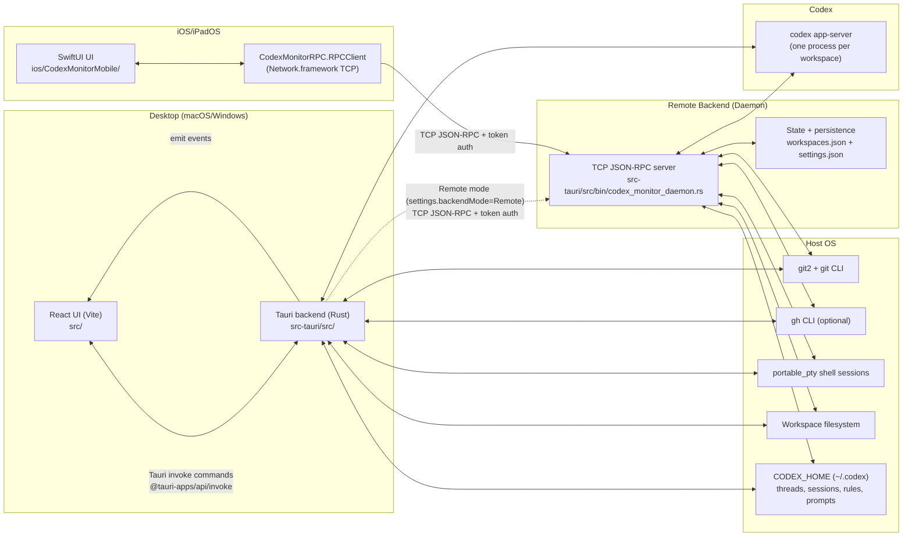

# CodexMonitor Architecture

This repository contains **CodexMonitor**, a multi-client UI for orchestrating **Codex `app-server`** sessions across multiple git workspaces.

CodexMonitor has three “front doors”:

- **Desktop app**: a **Tauri v2 + React** application (`src/` + `src-tauri/`).
- **iOS/iPadOS app**: a **SwiftUI** application (`ios/CodexMonitorMobile/`).
- **Rust daemon**: a **headless JSON-RPC-over-TCP server** that hosts Codex sessions (`src-tauri/src/bin/codex_monitor_daemon.rs`).

All clients ultimately drive the same backend concept:  
**one `codex app-server` process per workspace**, with UI state driven primarily by **streamed app-server events**.

---

## High-level system diagram



---

## Component inventory

### Desktop app (Tauri + React)

**Frontend**
- Path: `src/`
- Entry: `src/main.tsx` → `src/App.tsx`
- Responsibilities:
  - Workspace UI (projects sidebar)
  - Thread list + conversation rendering
  - Composer (models, reasoning effort, access mode, attachments)
  - Git panels (status/diffs/log/branches) + GitHub panels
  - Prompts library (global + per-workspace)
  - Terminal dock (optional)
  - Dictation (desktop-only; Whisper) and keyboard shortcuts
  - Layout state (sidebar sizes, tabs) persisted in `localStorage`

**Backend**
- Path: `src-tauri/src/`
- Entry: `src-tauri/src/main.rs` → `codex_monitor_lib::run()`
- Responsibilities:
  - Persisting local configuration (`workspaces.json`, `settings.json`)
  - Spawning/maintaining workspace Codex sessions (`codex app-server`)
  - Translating frontend invoke calls into backend actions
  - Emitting events back to the frontend (`app-server-event`, `terminal-output`, dictation events)
  - Optional **remote backend mode**: proxy all calls to a daemon over TCP (`src-tauri/src/remote_backend.rs`)

Key paths:
- Command registration: `src-tauri/src/lib.rs` (`tauri::generate_handler![...]`)
- Session spawning: `src-tauri/src/backend/app_server.rs` (`codex app-server`)
- Persistent state: `src-tauri/src/state.rs` + `src-tauri/src/storage.rs`
- Remote backend bridge: `src-tauri/src/remote_backend.rs`

### iOS/iPadOS app (SwiftUI)

- Path: `ios/CodexMonitorMobile/`
- Entry: `ios/CodexMonitorMobile/CodexMonitorMobile/CodexMonitorMobileApp.swift`
- Core state: `CodexStore` (`ios/.../CodexStore.swift`)
- Responsibilities:
  - Connect to remote daemon over TCP (host/port/token)
  - Browse workspaces, start/resume threads
  - Display conversation items driven by app-server events
  - Compose messages (text + photo library images + iOS speech dictation)
  - Basic settings UI (host, port, token)

### Daemon (Rust)

- Path: `src-tauri/src/bin/codex_monitor_daemon.rs`
- Responsibilities:
  - Headless, multi-client host for all “backend” functionality:
    - workspace lifecycle
    - git operations
    - terminal sessions
    - prompts CRUD
    - Codex session spawning + thread/turn operations
  - Maintain a broadcast event stream to all connected clients:
    - `app-server-event`
    - `terminal-output`
  - Persist the same state files as the desktop backend:
    - `workspaces.json`
    - `settings.json`

The daemon reuses most of the desktop backend modules via `#[path = "../..."]` imports.

### Swift packages

All Swift targets live in the single Swift package:

- Path: `ios/Packages/CodexMonitorRPC/Package.swift`

Targets:
- **CodexMonitorModels** (`Sources/CodexMonitorModels/`)
  - Shared Codable models for RPC and app-server events.
- **CodexMonitorRPC** (`Sources/CodexMonitorRPC/`)
  - TCP JSON-RPC client (`RPCClient`) + typed API wrapper (`CodexMonitorAPI`).
- **CodexMonitorRendering** (`Sources/CodexMonitorRendering/`)
  - Markdown / monospace `AttributedString` helpers.

---

## Primary data flow

### “User sends a message” from Mobile → Daemon → Codex → back

1. **User action (SwiftUI)**
   - User types in `ConversationView` and taps Send.
   - `CodexStore.sendMessage(...)` calls into `CodexMonitorAPI.sendUserMessage(...)`.

2. **Mobile RPC call**
   - `CodexMonitorRPC.RPCClient.call(...)` sends a single JSON line:
     - `{"id":N,"method":"send_user_message","params":{...}}`
   - **If connected with a token**, an `auth` call is sent once immediately after TCP connect.

3. **Daemon receives and validates**
   - The daemon reads one line = one JSON message (`BufRead::lines()`).
   - If not authenticated:
     - only `auth` is accepted
     - other methods return `{"error":{"message":"unauthorized"}}`
   - Once authenticated, the daemon dispatches to `handle_rpc_request(...)` which matches on method strings.

4. **Daemon forwards to Codex `app-server`**
   - `send_user_message` becomes an app-server request:
     - method: `"turn/start"`
     - params includes:
       - `threadId`
       - `input`: `["text", "image", "localImage"]` items
       - `cwd`: workspace root
       - `approvalPolicy`: `"on-request"` or `"never"` depending on access mode
       - `sandboxPolicy`: derived from access mode (`workspaceWrite` / `readOnly` / `dangerFullAccess`)
   - The daemon writes the JSON request to `codex app-server` stdin.

5. **Streaming events back**
   - `codex app-server` emits JSON notifications (stdout) like:
     - `item/agentMessage/delta`
     - `item/completed`
     - `turn/plan/updated`
     - `turn/completed`
     - `thread/tokenUsage/updated`
   - The daemon turns each into a notification to all clients:
     - `{"method":"app-server-event","params":{"workspace_id":"...","message":<raw>}}`

6. **Mobile updates UI**
   - `CodexStore` receives notifications and updates `@Published` properties on the MainActor.
   - Views update reactively.

The **desktop app** follows the same flow, except:
- In **local backend mode**, the Tauri backend spawns Codex itself and emits events to the React frontend.
- In **remote backend mode**, the Tauri backend proxies calls to the daemon and forwards daemon notifications as Tauri events.

---

## IPC mechanisms

### Desktop IPC: React ⇄ Tauri

- Request/response: `@tauri-apps/api/core.invoke(command, args)`
- Backend handler registry: `src-tauri/src/lib.rs` `tauri::generate_handler![ ... ]`
- Events:
  - Rust → JS: `app.emit("app-server-event", payload)` etc.
  - JS listens using `@tauri-apps/api/event.listen(...)` (see `src/services/events.ts`)

### Remote backend IPC: Client ⇄ Daemon

- Transport: raw TCP
- Message framing: **newline-delimited JSON** (one JSON object per line)
- Semantics: “JSON-RPC-ish”
  - Requests include `id` + `method` + `params`
  - Responses include `id` plus either `result` or `error.message`
  - Notifications omit `id` and include `method` + `params`

Clients:
- iOS: `Network.framework` (`NWConnection`) in `RPCClient.swift`
- Desktop (remote mode): `tokio::net::TcpStream` in `src-tauri/src/remote_backend.rs`

### Daemon ⇄ Codex

- Transport: stdio (`stdin` / `stdout` / `stderr`)
- Framing: newline-delimited JSON
- Spawn: `codex app-server` started by `spawn_workspace_session` (`src-tauri/src/backend/app_server.rs`)

---

## Persistence and storage

### Desktop app local storage

On desktop, persistent Rust backend state lives under the platform app-data directory:

- `workspaces.json` — persisted `WorkspaceEntry` list
- `settings.json` — persisted `AppSettings`

Path resolution happens in `src-tauri/src/state.rs` using Tauri’s app data dir APIs.

UI-only state is kept in browser storage:
- `localStorage` keys like:
  - `codexmonitor.threadLastUserActivity`
  - `codexmonitor.pinnedThreads`
  - panel sizes / layout preferences

### Daemon storage

The daemon stores the same JSON files under a configurable data dir:

- CLI: `--data-dir <path>`
- Default (Linux-style): `$XDG_DATA_HOME/codex-monitor-daemon` or `~/.local/share/codex-monitor-daemon`
- Files:
  - `<data-dir>/workspaces.json`
  - `<data-dir>/settings.json`
  - `<data-dir>/workspaces/<workspace-id>/prompts/` (workspace-scoped prompts)

### Codex storage

Codex’s own files are not stored in the app data dir. They live under:

- `$CODEX_HOME` (default `~/.codex/`) **or**
- a legacy workspace-local `.codexmonitor/` directory if present (see `src-tauri/src/codex_home.rs`)

CodexMonitor also writes/reads:
- `$CODEX_HOME/config.toml` feature flags under `[features]` (see `src-tauri/src/codex_config.rs`)
- `$CODEX_HOME/rules/default.rules` approval rules (see `src-tauri/src/rules.rs`)
- `$CODEX_HOME/prompts/` global prompts (see `src-tauri/src/prompts.rs`)
- `$CODEX_HOME/sessions/.../*.jsonl` for local usage scanning (see `src-tauri/src/local_usage_core.rs`)

---

## Authentication (mobile/remote)

The daemon uses a **single shared token**.

- Configure token by:
  - `--token <token>` CLI arg, or
  - `CODEX_MONITOR_DAEMON_TOKEN` env var
- Clients must call:

```json
{"id": 1, "method": "auth", "params": {"token": "…" }}
```

Until authenticated:
- All other methods return `error.message = "unauthorized"`
- If the token does not match, `error.message = "invalid token"`

**Important security notes**
- The transport is **plain TCP** (no TLS).
- Treat the token as a password. Do not expose the daemon port on the public internet.
- Recommended approach is to bind daemon to localhost and expose it privately via **Tailscale** (see `docs/DEPLOYMENT.md`).

