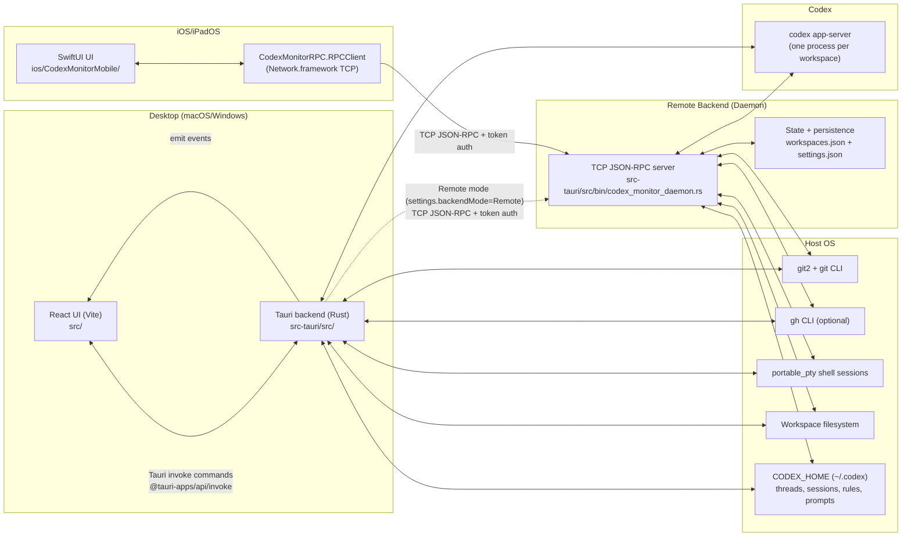

# CodexMonitor Architecture

This repository contains **CodexMonitor**, a multi-client UI for orchestrating **Codex `app-server`** sessions across multiple git workspaces.

CodexMonitor has three “front doors”:

- **Desktop app**: a **Tauri v2 + React** application (`src/` + `src-tauri/`).
- **iOS/iPadOS app**: a **SwiftUI** application (`ios/CodexMonitorMobile/`).
- **Rust daemon**: a **headless JSON-RPC-over-TCP server** that hosts Codex sessions (`src-tauri/src/bin/codex_monitor_daemon.rs`).

All clients ultimately drive the same backend concept:  
**one `codex app-server` process per workspace**, with UI state driven primarily by **streamed app-server events**.

---

## High-level system diagram



---

## Component inventory

### Desktop app (Tauri + React)

**Frontend**
- Path: `src/`
- Entry: `src/main.tsx` → `src/App.tsx`
- Responsibilities:
  - Workspace UI (projects sidebar)
  - Thread list + conversation rendering
  - Composer (models, reasoning effort, access mode, attachments)
  - Git panels (status/diffs/log/branches) + GitHub panels
  - Prompts library (global + per-workspace)
  - Terminal dock (optional)
  - Dictation (desktop-only; Whisper) and keyboard shortcuts
  - Layout state (sidebar sizes, tabs) persisted in `localStorage`

**Backend**
- Path: `src-tauri/src/`
- Entry: `src-tauri/src/main.rs` → `codex_monitor_lib::run()`
- Responsibilities:
  - Persisting local configuration (`workspaces.json`, `settings.json`)
  - Spawning/maintaining workspace Codex sessions (`codex app-server`)
  - Translating frontend invoke calls into backend actions
  - Emitting events back to the frontend (`app-server-event`, `terminal-output`, dictation events)
  - Optional **remote backend mode**: proxy all calls to a daemon over TCP (`src-tauri/src/remote_backend.rs`)

Key paths:
- Command registration: `src-tauri/src/lib.rs` (`tauri::generate_handler![...]`)
- Session spawning: `src-tauri/src/backend/app_server.rs` (`codex app-server`)
- Persistent state: `src-tauri/src/state.rs` + `src-tauri/src/storage.rs`
- Remote backend bridge: `src-tauri/src/remote_backend.rs`

### iOS/iPadOS app (SwiftUI)

- Path: `ios/CodexMonitorMobile/`
- Entry: `ios/CodexMonitorMobile/CodexMonitorMobile/CodexMonitorMobileApp.swift`
- Core state: `CodexStore` (`ios/.../CodexStore.swift`)
- Responsibilities:
  - Connect to remote daemon over TCP (host/port/token)
  - Browse workspaces, start/resume threads
  - Display conversation items driven by app-server events
  - Compose messages (text + photo library images + iOS speech dictation)
  - Basic settings UI (host, port, token)

### Daemon (Rust)

- Path: `src-tauri/src/bin/codex_monitor_daemon.rs`
- Responsibilities:
  - Headless, multi-client host for all “backend” functionality:
    - workspace lifecycle
    - git operations
    - terminal sessions
    - prompts CRUD
    - Codex session spawning + thread/turn operations
  - Maintain a broadcast event stream to all connected clients:
    - `app-server-event`
    - `terminal-output`
  - Persist the same state files as the desktop backend:
    - `workspaces.json`
    - `settings.json`

The daemon reuses most of the desktop backend modules via `#[path = "../..."]` imports.

### Swift packages

All Swift targets live in the single Swift package:

- Path: `ios/Packages/CodexMonitorRPC/Package.swift`

Targets:
- **CodexMonitorModels** (`Sources/CodexMonitorModels/`)
  - Shared Codable models for RPC and app-server events.
- **CodexMonitorRPC** (`Sources/CodexMonitorRPC/`)
  - TCP JSON-RPC client (`RPCClient`) + typed API wrapper (`CodexMonitorAPI`).
- **CodexMonitorRendering** (`Sources/CodexMonitorRendering/`)
  - Markdown / monospace `AttributedString` helpers.

---

## Primary data flow

### “User sends a message” from Mobile → Daemon → Codex → back

1. **User action (SwiftUI)**
   - User types in `ConversationView` and taps Send.
   - `CodexStore.sendMessage(...)` calls into `CodexMonitorAPI.sendUserMessage(...)`.

2. **Mobile RPC call**
   - `CodexMonitorRPC.RPCClient.call(...)` sends a single JSON line:
     - `{"id":N,"method":"send_user_message","params":{...}}`
   - **If connected with a token**, an `auth` call is sent once immediately after TCP connect.

3. **Daemon receives and validates**
   - The daemon reads one line = one JSON message (`BufRead::lines()`).
   - If not authenticated:
     - only `auth` is accepted
     - other methods return `{"error":{"message":"unauthorized"}}`
   - Once authenticated, the daemon dispatches to `handle_rpc_request(...)` which matches on method strings.

4. **Daemon forwards to Codex `app-server`**
   - `send_user_message` becomes an app-server request:
     - method: `"turn/start"`
     - params includes:
       - `threadId`
       - `input`: `["text", "image", "localImage"]` items
       - `cwd`: workspace root
       - `approvalPolicy`: `"on-request"` or `"never"` depending on access mode
       - `sandboxPolicy`: derived from access mode (`workspaceWrite` / `readOnly` / `dangerFullAccess`)
   - The daemon writes the JSON request to `codex app-server` stdin.

5. **Streaming events back**
   - `codex app-server` emits JSON notifications (stdout) like:
     - `item/agentMessage/delta`
     - `item/completed`
     - `turn/plan/updated`
     - `turn/completed`
     - `thread/tokenUsage/updated`
   - The daemon turns each into a notification to all clients:
     - `{"method":"app-server-event","params":{"workspace_id":"...","message":<raw>}}`

6. **Mobile updates UI**
   - `CodexStore` receives notifications and updates `@Published` properties on the MainActor.
   - Views update reactively.

The **desktop app** follows the same flow, except:
- In **local backend mode**, the Tauri backend spawns Codex itself and emits events to the React frontend.
- In **remote backend mode**, the Tauri backend proxies calls to the daemon and forwards daemon notifications as Tauri events.

---

## IPC mechanisms

### Desktop IPC: React ⇄ Tauri

- Request/response: `@tauri-apps/api/core.invoke(command, args)`
- Backend handler registry: `src-tauri/src/lib.rs` `tauri::generate_handler![ ... ]`
- Events:
  - Rust → JS: `app.emit("app-server-event", payload)` etc.
  - JS listens using `@tauri-apps/api/event.listen(...)` (see `src/services/events.ts`)

### Remote backend IPC: Client ⇄ Daemon

- Transport: raw TCP
- Message framing: **newline-delimited JSON** (one JSON object per line)
- Semantics: “JSON-RPC-ish”
  - Requests include `id` + `method` + `params`
  - Responses include `id` plus either `result` or `error.message`
  - Notifications omit `id` and include `method` + `params`

Clients:
- iOS: `Network.framework` (`NWConnection`) in `RPCClient.swift`
- Desktop (remote mode): `tokio::net::TcpStream` in `src-tauri/src/remote_backend.rs`

### Daemon ⇄ Codex

- Transport: stdio (`stdin` / `stdout` / `stderr`)
- Framing: newline-delimited JSON
- Spawn: `codex app-server` started by `spawn_workspace_session` (`src-tauri/src/backend/app_server.rs`)

---

## Persistence and storage

### Desktop app local storage

On desktop, persistent Rust backend state lives under the platform app-data directory:

- `workspaces.json` — persisted `WorkspaceEntry` list
- `settings.json` — persisted `AppSettings`

Path resolution happens in `src-tauri/src/state.rs` using Tauri’s app data dir APIs.

UI-only state is kept in browser storage:
- `localStorage` keys like:
  - `codexmonitor.threadLastUserActivity`
  - `codexmonitor.pinnedThreads`
  - panel sizes / layout preferences

### Daemon storage

The daemon stores the same JSON files under a configurable data dir:

- CLI: `--data-dir <path>`
- Default (Linux-style): `$XDG_DATA_HOME/codex-monitor-daemon` or `~/.local/share/codex-monitor-daemon`
- Files:
  - `<data-dir>/workspaces.json`
  - `<data-dir>/settings.json`
  - `<data-dir>/workspaces/<workspace-id>/prompts/` (workspace-scoped prompts)

### Codex storage

Codex’s own files are not stored in the app data dir. They live under:

- `$CODEX_HOME` (default `~/.codex/`) **or**
- a legacy workspace-local `.codexmonitor/` directory if present (see `src-tauri/src/codex_home.rs`)

CodexMonitor also writes/reads:
- `$CODEX_HOME/config.toml` feature flags under `[features]` (see `src-tauri/src/codex_config.rs`)
- `$CODEX_HOME/rules/default.rules` approval rules (see `src-tauri/src/rules.rs`)
- `$CODEX_HOME/prompts/` global prompts (see `src-tauri/src/prompts.rs`)
- `$CODEX_HOME/sessions/.../*.jsonl` for local usage scanning (see `src-tauri/src/local_usage_core.rs`)

---

## Authentication (mobile/remote)

The daemon uses a **single shared token**.

- Configure token by:
  - `--token <token>` CLI arg, or
  - `CODEX_MONITOR_DAEMON_TOKEN` env var
- Clients must call:

```json
{"id": 1, "method": "auth", "params": {"token": "…" }}
```

Until authenticated:
- All other methods return `error.message = "unauthorized"`
- If the token does not match, `error.message = "invalid token"`

**Important security notes**
- The transport is **plain TCP** (no TLS).
- Treat the token as a password. Do not expose the daemon port on the public internet.
- Recommended approach is to bind daemon to localhost and expose it privately via **Tailscale** (see `docs/DEPLOYMENT.md`).

---

## Memory System (Supabase + pgvector)

CodexMonitor includes a semantic memory system for storing and retrieving context across sessions.

### Architecture

```
┌─────────────────────────────────────────────────────────────────────┐
│                         Supabase (Cloud)                            │
│  ├── memory table (content, tags, embedding)                        │
│  ├── pgvector extension (cosine similarity search)                  │
│  └── search_memory_by_embedding() RPC function                      │
└─────────────────────────────────────────────────────────────────────┘
         │
         ▼ (REST API + anon key)
┌─────────────────────────────────────────────────────────────────────┐
│              Daemon (Rust) - Memory Service                         │
│  ├── MemoryService (src-tauri/src/memory/service.rs)                │
│  │   └── Calls Supabase REST API for CRUD + search                  │
│  ├── EmbeddingsClient (src-tauri/src/memory/embeddings.rs)          │
│  │   └── Calls MiniMax API for text → vector embeddings             │
│  └── JSON-RPC endpoints:                                            │
│      ├── memory_append      - Add new memory entry                  │
│      ├── memory_search      - Semantic search by query              │
│      ├── memory_bootstrap   - Fetch recent entries (cold start)     │
│      └── memory_delete      - Remove entry by ID                    │
└─────────────────────────────────────────────────────────────────────┘
         │
         ▼
┌───────────────┐     ┌───────────────┐     ┌───────────────┐
│   iOS App     │     │  Desktop App  │     │    Codex      │
│  Memory Tab   │     │  (Future)     │     │  MCP Server   │
│  (SwiftUI)    │     │               │     │  (Standalone) │
└───────────────┘     └───────────────┘     └───────────────┘
```

### Components

#### 1. Supabase Memory Table

PostgreSQL table with pgvector extension for semantic search:

```sql
CREATE TABLE memory (
  id UUID PRIMARY KEY DEFAULT gen_random_uuid(),
  content TEXT NOT NULL,
  memory_type TEXT DEFAULT 'daily',      -- 'daily' or 'curated'
  tags TEXT[] DEFAULT ARRAY[]::TEXT[],
  source TEXT DEFAULT 'codexmonitor',
  workspace_id TEXT,

  -- Embedding columns
  embedding vector,
  embedding_model TEXT,
  embedding_dim INT,
  embedding_status TEXT DEFAULT 'pending',

  created_at TIMESTAMPTZ DEFAULT now(),
  updated_at TIMESTAMPTZ DEFAULT now()
);
```

#### 2. MiniMax Embeddings

- **Model**: `embo-01` (1536 dimensions)
- **API**: `https://api.minimax.io/v1/embeddings`
- **Rate limit**: 15 seconds between requests
- **Types**: `"db"` for storage, `"query"` for search

Implementation: `src-tauri/src/memory/embeddings.rs`

#### 3. Daemon Memory Service

- **Path**: `src-tauri/src/memory/service.rs`
- Handles:
  - Append with auto-embedding generation
  - Semantic search via RPC function call
  - Bootstrap (fetch recent 50 entries)
  - CRUD operations

#### 4. MCP Server (Standalone)

For Codex CLI integration:

- **Binary**: `src-tauri/src/bin/codex_monitor_memory_mcp.rs`
- **Config**: Add to `~/.codex/config.toml`:

```toml
[mcp_servers.codex_monitor_memory]
command = "/path/to/codex_monitor_memory_mcp"
args = []
env = {
  SUPABASE_URL = "https://xxx.supabase.co",
  SUPABASE_ANON_KEY = "...",
  MINIMAX_API_KEY = "..."
}
```

**MCP Tools**:
| Tool | Description |
|------|-------------|
| `memory_append` | Store new memory with auto-embedding |
| `memory_search` | Semantic search by natural language query |
| `memory_bootstrap` | Get recent entries for context |

### Data Flow: Memory Search

1. **User query**: "What did I work on yesterday?"
2. **MiniMax API**: Query → 1536-dim embedding vector
3. **Supabase RPC**: `search_memory_by_embedding(vector, limit)`
4. **pgvector**: Cosine similarity search → ranked results
5. **Return**: Top N matching memory entries

### Configuration

Environment variables (daemon or MCP server):
- `SUPABASE_URL` - Supabase project URL
- `SUPABASE_ANON_KEY` - Supabase anonymous key
- `MINIMAX_API_KEY` - MiniMax API key for embeddings

---

## Auto-Memory System

CodexMonitor includes an automatic memory system inspired by ClawdBot that captures context before the model's context window fills.

### Architecture

```
┌─────────────────────────────────────────────────────────────────────┐
│                         Daemon (Rust)                               │
│  ├── AutoMemoryRuntime (src-tauri/src/memory/auto_flush.rs)         │
│  │   └── Tracks per-thread token usage, compaction epochs           │
│  ├── AutoMemoryCoordinator (in daemon main loop)                    │
│  │   └── Monitors thread/tokenUsage/updated events                  │
│  └── Background Summarizer                                          │
│      └── Spawns ephemeral Codex thread for commit-message style     │
│          summarization → writes to Supabase memory table            │
└─────────────────────────────────────────────────────────────────────┘
         │
         ▼
┌─────────────────────────────────────────────────────────────────────┐
│              Supabase Memory (daily + curated entries)              │
└─────────────────────────────────────────────────────────────────────┘
```

### Components

#### 1. AutoMemoryRuntime

- **Path**: `src-tauri/src/memory/auto_flush.rs`
- Maintains per-thread state:
  - `last_seen_context_tokens` — token count from last event
  - `last_compaction_epoch` — increments when Codex compacts context
  - `last_flush_at` — timestamp of last flush (rate limiting)
  - `last_flush_epoch` — prevents duplicate flushes per compaction

#### 2. Flush Trigger Logic

```rust
fn should_flush(settings, context_tokens, model_context_window) -> bool {
    let usable_window = model_context_window - reserve_tokens_floor;
    context_tokens >= usable_window - soft_threshold_tokens
}
```

Compaction detection: if `new_tokens + (new_tokens / 2) < previous_tokens`, a compaction occurred and epoch increments.

#### 3. Snapshot Builder

When a flush triggers:
1. Call `thread/resume` to fetch recent turns
2. Extract user/assistant messages (optionally tool output)
3. Collect `git status -sb` + `git diff --stat` if configured
4. Build `MemoryFlushSnapshot` struct

#### 4. Background Summarizer

Spawns an ephemeral Codex thread with a structured prompt:
- Input: `MemoryFlushSnapshot` as JSON
- Output: JSON with `{ no_reply, title, tags, daily_markdown, curated_markdown }`
- Timeout: 60 seconds
- Thread is archived after completion

The summarizer uses a "commit message" pattern — extract durable facts, decisions, TODOs, and project state worth remembering.

### Configuration

`AutoMemorySettings` in `settings.json`:

| Field | Default | Description |
|-------|---------|-------------|
| `enabled` | `false` | Enable auto-memory |
| `reserveTokensFloor` | `20000` | Tokens to reserve for output |
| `softThresholdTokens` | `4000` | Buffer before flush trigger |
| `minIntervalSeconds` | `300` | Minimum time between flushes |
| `maxTurns` | `12` | Max turns to include in snapshot |
| `maxSnapshotChars` | `12000` | Max chars for tool output |
| `includeToolOutput` | `false` | Include tool results |
| `includeGitStatus` | `false` | Include git status/diff |
| `writeDaily` | `true` | Write to daily memory type |
| `writeCurated` | `true` | Write to curated memory type |

### RPC Endpoints

| Method | Description |
|--------|-------------|
| `memory_flush_now` | Force immediate flush for a thread (params: `workspaceId`, `threadId`, `force`) |

---

## Browser Control System

CodexMonitor provides browser automation capabilities through a Playwright-based worker process.

### Architecture

```
┌─────────────────────────────────────────────────────────────────────┐
│                      Daemon (Rust)                                  │
│  └── BrowserService (src-tauri/src/browser/service.rs)              │
│      └── Spawns and manages browser-worker process                  │
│      └── JSON-RPC over stdio                                        │
└─────────────────────────────────────────────────────────────────────┘
         │ stdio (newline-delimited JSON)
         ▼
┌─────────────────────────────────────────────────────────────────────┐
│               browser-worker (Node.js + Playwright)                 │
│  └── browser-worker/src/index.ts                                    │
│      └── Manages browser sessions (Chromium)                        │
│      └── Handles navigation, clicks, typing, screenshots            │
└─────────────────────────────────────────────────────────────────────┘
         │
         ▼
┌───────────────┐
│   Chromium    │
│   Browser     │
└───────────────┘
```

### Components

#### 1. BrowserService (Rust)

- **Path**: `src-tauri/src/browser/service.rs`
- Lazy-spawns `browser-worker` on first request
- Maintains persistent connection via stdin/stdout
- Request/response matching by JSON-RPC `id`

Environment variable:
- `CODEX_MONITOR_BROWSER_WORKER` — path to worker script (default: `browser-worker/dist/index.js`)

#### 2. Browser Worker (Node.js)

- **Path**: `browser-worker/src/index.ts`
- Dependencies: `playwright` (Chromium)
- Session management: `Map<sessionId, Session>`
- Each session holds: `Browser`, `BrowserContext`, `Page`

Supported features:
- Headless or headed mode
- Custom viewport sizes
- Persistent user data directories
- DOM element extraction for snapshot

#### 3. Browser MCP Server

- **Binary**: `src-tauri/src/bin/codex_monitor_browser_mcp.rs`
- Exposes browser tools to Codex CLI via MCP protocol
- Connects to daemon over TCP, proxies browser RPC calls

**Config**: Add to `~/.codex/config.toml`:

```toml
[mcp_servers.codex_monitor_browser]
command = "/path/to/codex_monitor_browser_mcp"
args = []
env = {
  CODEX_MONITOR_DAEMON_ADDR = "127.0.0.1:4732",
  CODEX_MONITOR_DAEMON_TOKEN = "..."
}
```

### RPC Endpoints

| Method | Description |
|--------|-------------|
| `browser_create_session` | Create new browser session (params: `headless`, `viewport`, `userDataDir`, `startUrl`) |
| `browser_list_sessions` | List active session IDs |
| `browser_close_session` | Close session (params: `sessionId`) |
| `browser_navigate` | Navigate to URL (params: `sessionId`, `url`, `waitUntil`, `timeoutMs`) |
| `browser_screenshot` | Capture screenshot (params: `sessionId`, `fullPage`) → returns `base64Png` |
| `browser_click` | Click by selector or coordinates (params: `sessionId`, `selector` or `x`/`y`) |
| `browser_type` | Type into element (params: `sessionId`, `selector`, `text`, `clearFirst`) |
| `browser_press` | Press keyboard key (params: `sessionId`, `key`) |
| `browser_evaluate` | Execute JavaScript (params: `sessionId`, `js`) |
| `browser_snapshot` | Screenshot + DOM element list (params: `sessionId`, `fullPage`) |

### MCP Tools

The browser MCP server exposes the same tools with identical names and parameters.

---

## Skills Management System

CodexMonitor includes a skills system for managing reusable agent capabilities defined in SKILL.md files.

### Architecture

```
┌─────────────────────────────────────────────────────────────────────┐
│                      Daemon (Rust)                                  │
│  ├── SKILL.md Parser (src-tauri/src/skills/skill_md.rs)             │
│  │   └── Parses YAML frontmatter + markdown body                    │
│  └── Skills Service (in daemon RPC handlers)                        │
│      └── List, validate, install from git, uninstall                │
└─────────────────────────────────────────────────────────────────────┘
         │
         ▼
┌─────────────────────────────────────────────────────────────────────┐
│                   Filesystem                                        │
│  ├── $CODEX_HOME/skills/           (global skills)                  │
│  └── <workspace>/.codex/skills/    (workspace skills)               │
│      └── <skill-name>/SKILL.md                                      │
└─────────────────────────────────────────────────────────────────────┘
```

### SKILL.md Format

Skills are defined using markdown files with YAML frontmatter:

```markdown
---
name: my-skill
description: A helpful skill for doing X
requirements:
  bins:
    - jq
    - curl
  env:
    - MY_API_KEY
  os:
    - macos
    - linux
---

# My Skill

Instructions for the agent when this skill is invoked...
```

### Components

#### 1. SKILL.md Parser

- **Path**: `src-tauri/src/skills/skill_md.rs`
- Extracts:
  - `name` — from frontmatter or parent directory name
  - `description` — from frontmatter or first non-empty line of body
  - `requirements.bins` — required CLI binaries
  - `requirements.env` — required environment variables
  - `requirements.os` — supported operating systems

#### 2. Skill Validation

The `validate_skill()` function checks:
1. **OS compatibility**: current OS in `requirements.os` list
2. **Binary availability**: all `requirements.bins` found via `which`
3. **Environment variables**: all `requirements.env` are set

Returns a list of issues (empty = valid).

#### 3. SkillDescriptor

```rust
pub struct SkillDescriptor {
    pub name: String,
    pub description: Option<String>,
    pub path: String,
    pub requirements: Requirements,
}
```

### RPC Endpoints

| Method | Description |
|--------|-------------|
| `skills_list` | List installed skills (params: `workspaceId`) |
| `skills_config_write` | Write skills configuration (params: `workspaceId`, `config`) |
| `skills_validate` | Validate all installed skills (params: `workspaceId`) → returns issues per skill |
| `skills_install_from_git` | Clone skill from git repo (params: `sourceUrl`, `target`) |
| `skills_uninstall` | Remove installed skill (params: `name`, `target`) |

### Installation Targets

- `"global"` — installs to `$CODEX_HOME/skills/`
- `"workspace"` — installs to `<workspace>/.codex/skills/`

